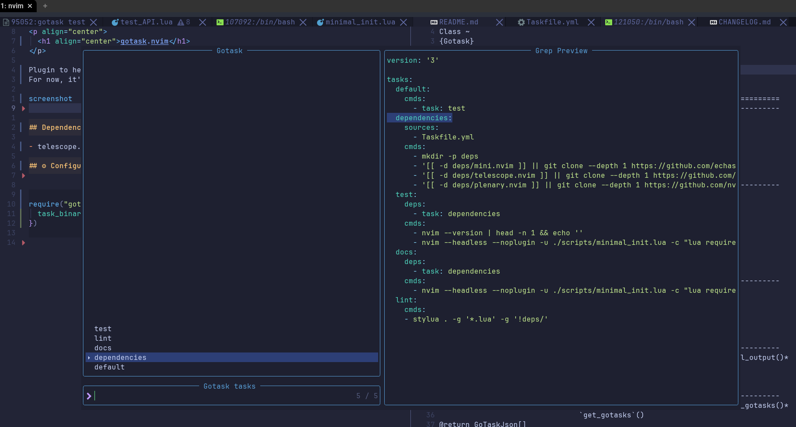

<p align="center">
  <h1 align="center">gotask.nvim</h1>
</p>

Plugin to help with [gotask](https://taskfile.dev).
For now, it's just a Telescope extension that lets you pick a task to run.

It's very much alpha and it's my first plugin, so don't expect too much.

Feel free to open issues or PRs.




## Dependencies
- nvim >= 0.10 (Currently the prerelease version. Only because I use vim.system - if this is a problem, feel free to suggest an alternative)
- telescope.nvim
- a task binary in your PATH

## Usage

`Telescope gotask` will show a list of tasks in your taskfile. Selecting one will run it.

## ⚙ Configuration


```lua
require("gotask").setup({
  task_binary = "task", -- the binary to use
})
```

## Health check

Run `:checkhealth gotask` to see if everything is working. There will be a section called `gotask.nvim`.

